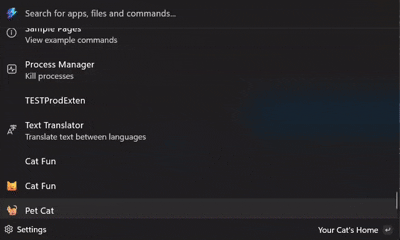

# Cat Pet Extension — Virtual Cat for the Command Palette

A playful, virtual cat you can adopt and care for from the Microsoft Command Palette. You can adopt a cat, play, feed, groom, put it to bed, view status and achievements — all without leaving the palette.



## 🎯 Key Highlights

- **Local-first**: Pet state persists on disk (no telemetry or external servers by default)
- **Lightweight WinUI extension** built for .NET 9 and the Microsoft Command Palette framework
- **Rich interactions**: adopt/create, play, feed, groom, sleep, view status, manage achievements, and give up for adoption
- **Personality system** and achievements to make each cat feel unique
- **Published on Microsoft Store** and **WinGet** for easy installation

## 📦 Installation

### Via WinGet (Recommended)
```powershell
winget install JessicaDeneEarley-Cha.CmdPalCatPetExtension
```

### Via Microsoft Store
Search for "Cat Pet Extension" in the Microsoft Store or visit the [Store listing](https://apps.microsoft.com/store/detail/cat-pet-extension/9P7JQZQZQZQZ).


## ✨ Features

- **Adopt** a virtual cat with randomized personality and initial stats
- **Interactive care**: Play, feed, groom, and put your cat to bed
- **Dynamic stats system**: Energy, Hunger, Happiness, and Hygiene that change over time
- **Rich achievements system** with unlockable badges for various milestones
- **Persistent storage**: Cat data saved locally so your pet persists across sessions
- **Command Palette integration**: All interactions happen within the Command Palette interface
- **Personality traits**: Each cat has unique characteristics that affect interactions


## 📋 Requirements

- **Windows 10 / Windows 11** with the Windows App SDK supported version (this project targets net9.0-windows10.0.22621.0)
- **.NET 9 SDK** for development
- **Microsoft Command Palette runtime** (the extension targets the Microsoft.CommandPalette.Extensions framework)
- **Microsoft.WindowsAppRuntime.1.6** dependency (automatically handled by WinGet/Store installation)

## Privacy

All cat state is stored locally in user-local application data. No external services are contacted by default.

## 🛠️ Development

### Building the Project
1. Clone the repository
2. Open `CmdPalCatPetExtension.sln` in Visual Studio 2022 or VS Code
3. Restore NuGet packages
4. Build and run

### Where pet data is stored

Saved file (JSON):
%LOCALAPPDATA%\CmdPalCatPetExtension\virtualcat.json

If you need to remove a saved cat during testing, see `Tools/DeleteVirtualCat.ps1` or delete the file above.

### Project structure

- `CmdPalCatPetExtension/`
  - `CmdPalCatPetExtensionCommandsProvider.cs` — registers the top-level "Pet Cat" command.
  - `CmdPalCatPetExtension.cs` / `Program.cs` — extension bootstrap and registration.
  - `Pages/`
    - `CmdPalCatPetExtensionPage.cs` — top-level page that routes to other pages.
    - `CreateCatPage.cs` — adopt / create a new cat and set its name.
    - `FeedCat.cs` — feeding UI and logic.
    - `PlayWithCat.cs` — play interactions and timers.
    - `PutCatToBed.cs` — sleeping logic to restore energy.
    - `Groom.cs` — grooming action to restore hygiene.
    - `GiveUpForAdoptionPage.cs` — remove the current cat (delete save).
    - `CatStatusPage.cs` — view current stats and counters.
    - `AchievementsPage.cs` — view and claim achievements.
  - `Models/VirtualCat.cs` — in-memory model for a cat (Name, Energy, Hunger, Happiness, Hygiene, counters, personality).
  - `Services/`
    - `CatRepository.cs` — local JSON persistence and change notifications.
    - `AchievementsService.cs` — achievement definitions and unlock logic.
    - `CatJsonContext.cs`, `CatRepository.cs` — storage utilities for managing saved data.
  - `Assets/` — cat images and icons used by the UI.
  - `Tools/DeleteVirtualCat.ps1` — helper script for test cleanup.

## 🤝 Contributing

Contributions, issues, and suggestions are welcome! Here's how to help:

- **Report bugs**: Open an issue with detailed reproduction steps
- **Suggest features**: Create an issue with your feature request
- **Contribute code**: Fork the repo, create a branch, and submit a pull request
- **Improve documentation**: Help make the README and guides better


## 📄 License

This project is licensed under the MIT License — see the LICENSE file for details.

## 👤 Author

[Jessica Dene Earley-Cha](htthttps://www.jessicadeneearley-cha.com/)  |  [https://github.com/chatasweetie](https://github.com/chatasweetie)

---

*Made with ❤️ for Command Palette enthusiasts and virtual pet lovers!*